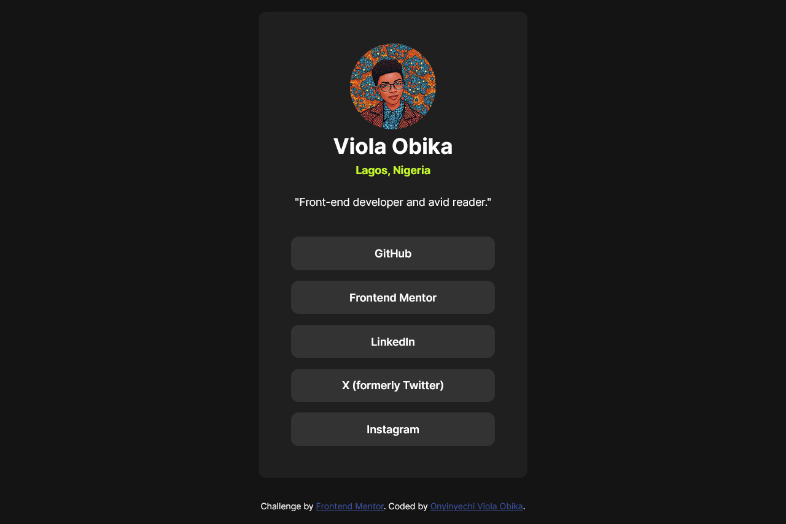

# Frontend Mentor - Social links profile solution

This is a solution to the [Social links profile challenge on Frontend Mentor](https://www.frontendmentor.io/challenges/social-links-profile-UG32l9m6dQ). Frontend Mentor challenges help you improve your coding skills by building realistic projects. 

## Table of contents

- [Overview](#overview)
  - [The challenge](#the-challenge)
  - [Screenshot](#screenshot)
  - [Links](#links)
- [My process](#my-process)
  - [Built with](#built-with)
  - [What I learned](#what-i-learned)
  - [Useful resources](#useful-resources)
- [Author](#author)

## Overview

### The challenge

Users should be able to:

- See hover and focus states for all interactive elements on the page

### Screenshot




### Links

- Solution URL: [My Frontend Mentor Solution](https://www.frontendmentor.io/solutions/responsive-social-links-profile-7HVSoXnCvS)
- Live Site URL: [My Live Site](https://obikaviola.github.io/social-links-profile/)

## My process

### Built with

- Semantic HTML5 markup
- CSS custom properties
- Flexbox
- Mobile-first workflow


### What I learned

Through this challenge, I was able to understand how to create and use the container class. I was also able to understand the how to use the **_font face_** attributes.

To see how you can add code snippets, see below:

```css
@font-face {
    font-family: 'Inter';
    src: url(assets/fonts/Inter-VariableFont_slnt\,wght.ttf);
}
```

### Useful resources

- [Conquering Responsive Layout](https://courses.kevinpowell.co/view/courses/conquering-responsive-layouts) - This course helped me in understanding the technicalities behind creating a responsive layout.

## Author

- Hashnode Blog - [Onyinyechi Viola Obika](https://obikaviola.hashnode.dev/)
- Frontend Mentor - [@Obikaviola](https://www.frontendmentor.io/profile/Obikaviola)
- LinkedIn - [@onyinyechi_obika](https://www.linkedin.com/in/onyinyechi-obika)
- X - [@obika_viola](https://www.x.com/obika_viola)
